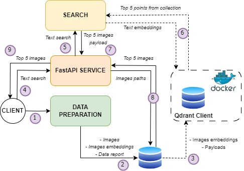
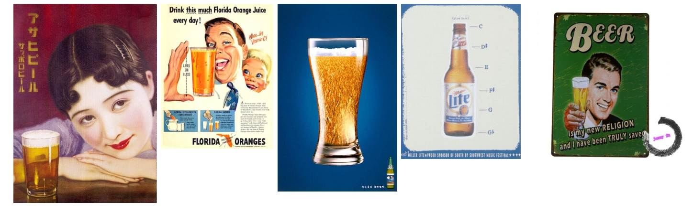
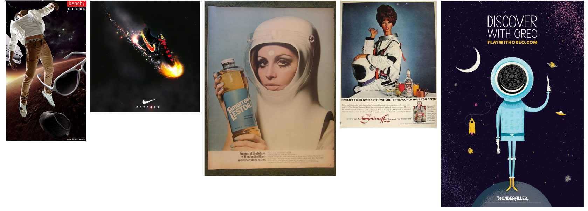
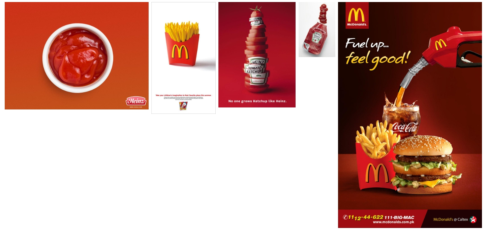
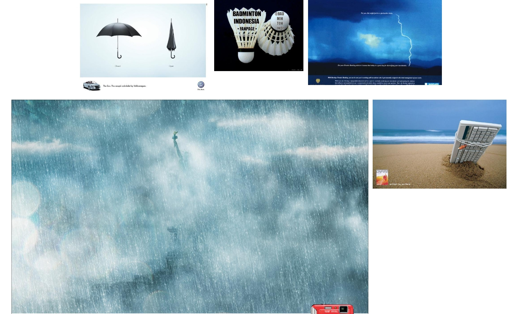
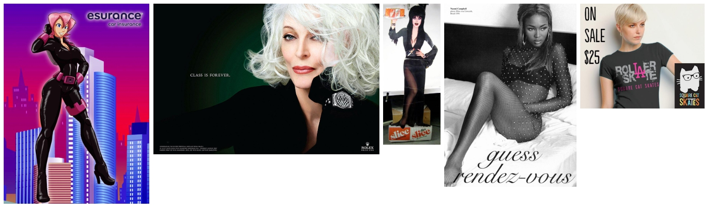
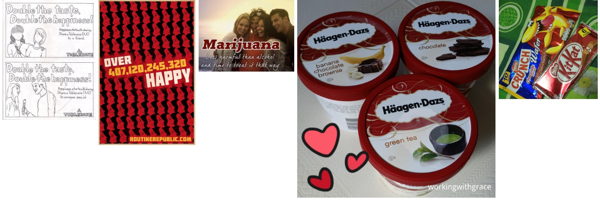

# Text 2 Image Search


## :grey_question: Introduction
This is a Text-to-Image system based on Qdrant vector database, a system capable of searching for similar images based on textual queries.

The data for retrieval is represented by adds posters from Google, provided at these links: 
[first part](https://storage.googleapis.com/ads-dataset/subfolder-0.zip), [second part](https://storage.googleapis.com/ads-dataset/subfolder-0.zip).
You do not need to download the data, as everything is managed automatically in the code.

## :open_file_folder: Project structure
```
├───templates                   <- includes Jinja templates used in the project
│   ├───data_report_template.py
│   └───images_template.py
├───src                         <- FastAPI dources
│   └───schemas.py              <- schemas for FastAPI
├───utils
│   ├───data.py                 <- data related utils
│   ├───search.py               <- search related utils
│   └───utils.py                <- general utils
├───evaluate.py                 <- endpoint for evaluating the algorithm
├───service.py                  <- endpoint for launching FastAPI app
└───prepare.py                  <- endpoint for creating data report and populating the images vector DB
```

## :gear: Installation
1. Install [Docker](https://docs.docker.com/engine/install/) locally

2. Install all the libraries:
```bash
pip install requirements.txt
```

3. Get the Qdrant image from Docker Hub:
```bash
docker pull qdrant/qdrant
```
4. Start Qdrant inside of Docker:

  - Linux:
```bash
docker run -p 6333:6333 -v $(pwd)/qdrant_storage:/qdrant/storage qdrant/qdrant
```
- Windows:
```bash
docker run -p 6333:6333 -v %cd%/qdrant_storage:/qdrant/storage qdrant/qdrant
```

## :hammer_and_wrench: Architecture



**Details**:
- Both image and text embeddings (dim=512) are created using a `CLIP-ViT-B-32` model
- I use Jinja templates for creating the data report that uses local plots
- I use Jinja templates to render the search form and images in the FastAPI app
- The search form is validated to contain only words (letters) and spaces
- After entering the text in a search form, I am making a POST to the API which does the following:
  - Send the form data to the search engine, which embeds the text and performs ANN
  - The search engine outputs the payload of the 5 most relevant images. The payload consists of the images paths.
  - The local images paths are sent to a Jinja template so that they are displayed in the same UI as the search form
- I tweaked the HNSW parameters (even though not necessary), as the dataset was not that big, thus the indexing time was manageable:
  - I set `m=32` (the number of edges per node)
  - I set `ef_construct=200` (the number of neighbours to consider during the index building)

## :computer: Usage
Use the following command to:
- Download, organise and extract information about the data under  `resources/data_info.csv`
- Create data report under `resources/data_report.html`
- Build the image embeddings and store them under `resources/image_embeddings.parquet`
- Create and populate a Qdrant collection with the image embeddings

```bash
python prepare.py
```

To launch the FastAPI app, execute the following command:
```bash
python service.py
```

To evaluate the algorithm according to [Evaluation section](#eval), execute the following command:
```bash
python evaluate.py <PATH_TO_LABELS_TXT>
```
**IMPORTANT NOTE**: The queries have to be defined in `<PATH_TO_LABELS_TXT>` file, one on each row.
I already provide an example at `docs/labels.txt` file.

## :fire: Results

#### :smiley: Good examples:
- Search term: **beer**

- Search term: **astronaut**

- Search term: **fries with ketchup**

- Search term: **bad weather**


#### :disappointed: Bad examples...hmmmmm...or not really.....
- Search term: **black cat** -> are images of black cats actually in the data?

- Search term: **happiness** -> ..."less harmful than alcohol" they say.... But chocolate brings me happiness, indeed.


## <a name="eval"></a> :white_check_mark: Evaluation of retrieval accuracy
By following the best practices offered by Qdrant [here](https://qdrant.tech/documentation/tutorials/retrieval-quality/),
I evaluated my ANN algorithm by using `precision@k` with `k=30`, by comparing it with the full kNN search and 
seeing how well the ANN algorithm approximates the exact search. For the very small list of queries defined in `docs/label.txt`, the `precision=1.0`.

## :chart_with_downwards_trend: :chart_with_upwards_trend: Challenges and Improvements

#### Challenges
- Connection between Jinja templates and FastAPI backend (especially the form data in the template)

#### Improvements
- Use `poetry` for better dependencies solving
- Use better models for embedding the images and texts (e.g. maybe use a service like AWS, Eden AI, or models from MTEB leaderboard)
- Use a feature store to store the embeddings instead of storing them locally
- Use a different storage than local for th images (e.g. a cloud provider)
## :top: Conclusions

- It seems that the text-2-img system does a pretty good job and that the CLIP embeddings are good enough

## :man: Contributors
Mihai David - [davidmihai9805@gmail.com](mailto:davidmihai9805@gmail.com)